# Binary neural network training by flip back propagation method

# ~ Overhaul neural network learning methods


# SUMMARY

- We propose a new method for learning binary neural networks (BNN), the flip back propagation method.
- The BNN is learned by back propagating flips instead of gradients. By inter-converting gradient and flip, the BNN can be trained together with traditional neural networks.
- It can be incorporated into an PyTorch framework for training, making it low cost to implement and easy to operate.
- Since the binary weights are learned directly, it may be advantageous for "training huge models with a large number of parameters", "training BNNs with high accuracy", and "fast training".


# Background

- While the number of parameters of neural networks is increasing, the memory capacity of GPUs is finite, and memory reduction is an issue.
- Until now, the common method for learning binary neural networks has been to train with Float32 (FP32) weights, which are continuous values, and then convert the weights to binary after the training is completed.
- However, this method has problems with accuracy degradation when converting the weights to binary weights, and with the large amount of VRAM used during training.
- Therefore, this method solves the above issues by directly learning binary weights by back-propagating flips instead of gradients.


## Features of Binary Learning

## Optimal value in one step

- The value update is represented by a flip, i.e., "to flip (1) or not to flip (0)" in one bit.

Figure. Example of updating by flipping bits

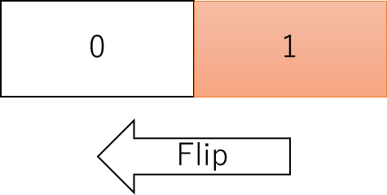

- Since each weight is represented by only two values, if the update instructions are accurate, they will converge to the optimal value in one step.
  - In actual learning, this does not mean that learning is completed in a single step, since the appropriate update instructions change as the learning of the previous layer progresses.

- On the contrary, continuous-valued gradient updating converges to the optimal value after multiple updates.

Figure . Example of updating continuous values in the gradient direction

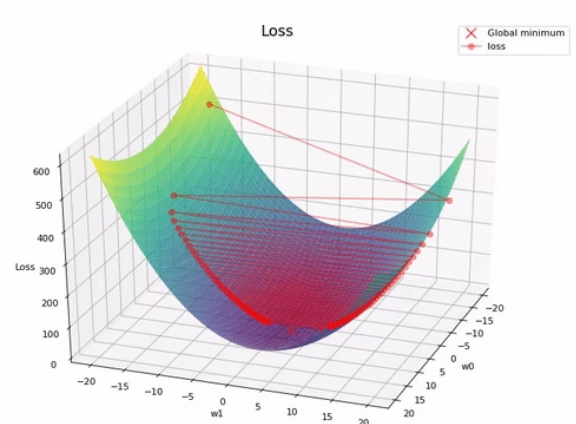

- Therefore, it may be possible to complete the training in fewer steps than FP32 weights.


## Conversion between grad and flip

- Since binary weights are discrete values and cannot be updated by existing gradients, it is necessary to reconsider how to update binary values.
- Since binary values are binary only, the update signal only tells whether the value is flipped or not (flip).


Figure . Correspondence between "gradient of FP32 weights" and "flip of binary weights

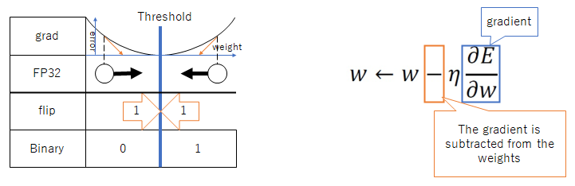

- When FP32 weights are binarized with thresholds to obtain binary weights, the gradient (grad) and inversion(flip) conversions are as follows, respectively.
    - grad to flip
      - When the FP32 weights are gradient updated in the direction of exceeding the threshold, the corresponding binary weights are also updated in the direction of flipping, so flip is set to 1.
      - When the FP32 weights are gradient updated in the direction opposite to the threshold, flip is 0.
    - flip to grad 
      - The contribution to grad is calculated from "flip" and "the magnitude of the FP32 weights and thresholds for which grad is to be calculated" as follows.
        - When flip is 0 : 0
        - When flip is 1 and FP32 weight is greater than the threshold : 1
        - When flip is 1 and FP32 weight is less than threshold : -1
      - Sum the contributions to obtain the grad.
- In the above method, gradient and inversion can be converted to each other.


## BitBalance

- The operation BitBalance is defined for bit strings.
- The number of 1's - the number of 0's is used to obtain the gradient.
  - It can also be calculated by "2 * PopCount - number of all bits".
- The distribution of PopCount is a binomial distribution with mean 0.5N and standard deviation 0.5√N when the probability of occurrence of a bit of 1 is p=0.5.
- The distribution of BitBalance is binomial with mean 0 and standard deviation 0.5√N when p=0.5.
- Therefore, we adopted BitBalance for BMA integration, etc., because it is easy to judge whether the value aggregated by BitBalance is larger than the mean value, and it is easy to perform binarization, etc.


# Proposed method

## Learning method: Flip Back Propagation Method

- We propose a new learning method, inverse back propagation, which learns by back propagating binary value flips.
- Binary weights are updated using flips, which is not possible with existing gradient update methods.


Figure. Back propagation of gradient and flips while transforming each other

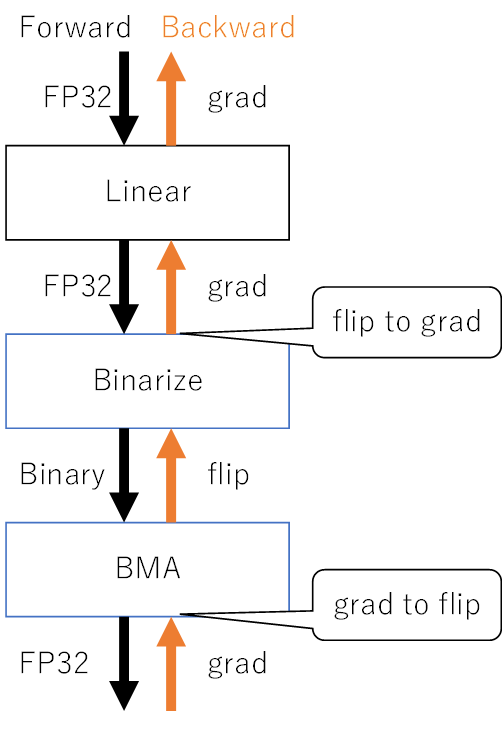


- Learning Procedure
  1. grad to flip: convert gradient to flip.
  Update the weights: Aggregate the back-propagated inversions in a mini-batch, etc., and decide whether the weights should be flipped (flip). In the model trained in this experiment, the weights in the BMA layer (see below) are updated. 1.
  1. flip to grad: Convert the flipping to grad and propagate back to the previous layer. (thus allowing regular neural networks to be trained together)

- This flip back propagation method makes both the weights and the back propagation signal binary and can greatly reduce memory consumption


## Technics to converge learning

### Increase the number of inverted votes to update accurately

- Issue
  - Binary weights "become the optimal value in one step" and "cannot accumulate and retain past update information because they are 1-bit," so the accuracy of a single update signal is important.
  - To make the update signal accurate, it is necessary to increase the number of votes when tallying inversions to determine whether to update the weights.
- Countermeasure: Possible ways to increase the number of votes for inversions include the following
  - Increase the batch size: Increasing the batch size will increase the number of votes for inversion since more input data is considered in one update.
  - Increase the multiplicity: If binary weights are used in multiple locations, the back propagation signal can be obtained from each of them, thus increasing the number of votes for inversion. weight sharing, such as CNN and RNN, is effective.
    - In addition, depth modulation, discussed below, also benefits from multiplexing by weight sharing. Since the same weights are applied to each depth axis, the back propagation signal can be obtained from each depth.
- Example of inverted voting
  - In this experiment, a tensor with "b,d,o,i" axes was input and output, and a binary weight tensor with "o,i" axes was learned.
  - With batch size b=64 and depth axis d=3, this results in 64*3 = 192 inverted votes for each weight bit.


### Series Back Propagation

- Issue
  - For bitwise operations such as XNOR, if one of the inputs is inverted, the result is completely different.
  - Therefore, if back propagation is performed on two inputs simultaneously (parallel back propagation) and both inputs are learned to be inverted, the desired result cannot be obtained.

- Countermeasure - Series back propagation: Therefore, first back propagate to one input, recalculate the inverted signal at the updated input, and back propagate to the other input (series back propagation).
  - For example, in the BMA layer, the shallow weights of the path are updated first.
- Disadvantage: With series back propagation, multiple paths cannot be learned at the same time, so the parallelism of the processors cannot be fully utilized, which may worsen the computational efficiency.


Figure. Example of back propagation paths
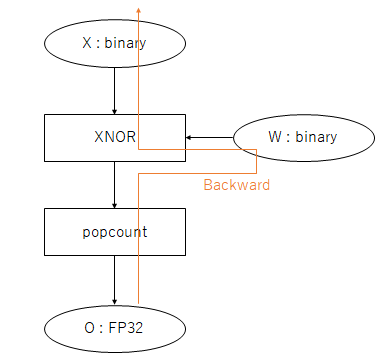


### depth modulation

- Prior research has shown that binaryized data at different thresholds can be input to the same network to improve accuracy while reducing the memory footprint.
  - Reference：[Fully Binary Neural       Network への変調入力の評価結果(復刻記事)](https://ryuz.hatenablog.com/entry/2021/04/03/211029)
- Following this approach, the output tensor of the Binarize layer adds a depth axis corresponding to the bit depth and holds as much data as the number of threshold values.
  - For example, by binarizing with 3 thresholds and handling a tensor with a depth axis of 3, data equivalent to a bit depth of 2 (4 different values) can be represented.
    


### Offline Learning

- Problem: In the late stages of mini-batch learning, we observed an oscillating phenomenon in ACCURACY.

Figure. Oscillation of ACCURACY in the late stage of learning

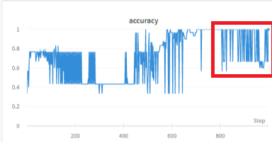


- Cause: Due to the property of BNN to reach the optimal value in one step, the randomness of the sample combination in the mini-batch may have affected the generalization performance.
- Countermeasure: Therefore, we avoided this problem by learning with all data (offline learning) at the end of the training.


## Advantages of this method

- Low VRAM during learning: Since "weights, forward propagation values, and back propagation values during learning" are binary values, training can be done with less VRAM, which may be advantageous when training huge models with a large number of parameters.

- High-precision BNN: Since the binary weights are learned directly, it may be advantageous for training high-precision BNNs.
- Fast learning: Due to the property of optimal value in one step of binary learning, it may be possible to complete learning in fewer steps than FP32 neural networks.


# Implementation

- Since gradient and inversion can be converted to each other, it was implemented as part of the existing PyTorch.
- The implementation cost is low and easy to operate because existing frameworks can be leveraged.
  - In particular, the training data loading and training workflow were able to use the PyTorch+fastai mechanism as is.

- Tensor axes: The axes of the tensor to be forward and back propagated are at most `b,d,o,i
    - b(batch) : mini-batch
    - d(depth) : depth modulation (corresponds to bit depth)
    - o(out) : number of dimensions after BMA layer conversion
    - i(in) : number of dimensions before BMA layer conversion


## Layer implementation

### Binarize Layer

- Binarizes the input FP32 tensor with multiple thresholds and outputs a binary tensor.
- Back propagation computes the contribution from the inversion to obtain the gradient


Figure. Binarize Layer Summary: Tensor shape and Forward/Backward calculation method

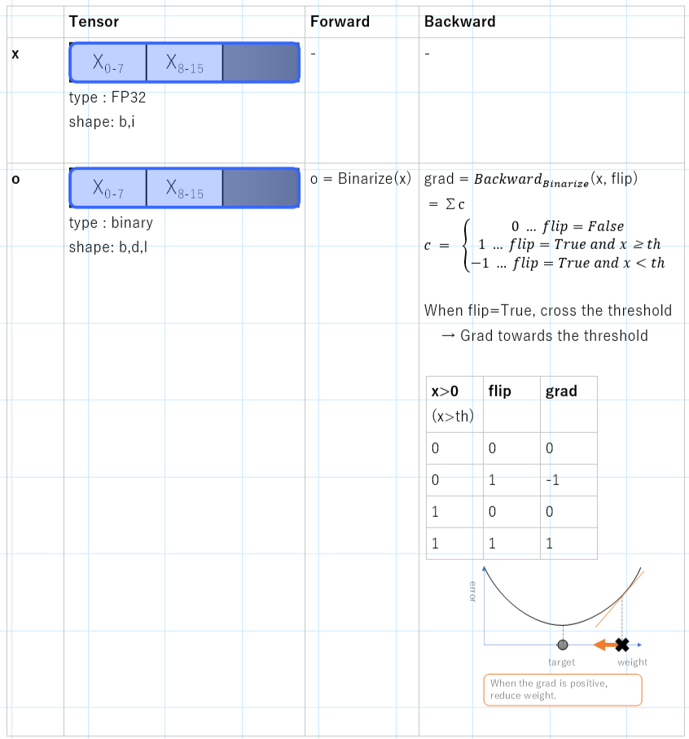


### BMA（Binary Multiply-Accumulate） Layer

- Binary version of the integration operation by XNOR and bit counting was implemented with reference to the following paper.

  - Paper　[Bitwise Neural Networks](https://saige.sice.indiana.edu/wp-content/uploads/icml2015_mkim.pdf)

  - Commentary Blog [Understanding Binary Neural Networks - ALL THINGS GEEKY](https://sushscience.wordpress.com/2017/10/01/understanding-binary-neural-networks/)

    - Replace FP32's sum-of-products operation with Binary's XNOR and Accumulate

    - XNOR and Popcount can be implemented with far fewer gates than MAC (sum-of-products).


Figure. Summary of BMA layer: Tensor shape and Forward/Backward computation method

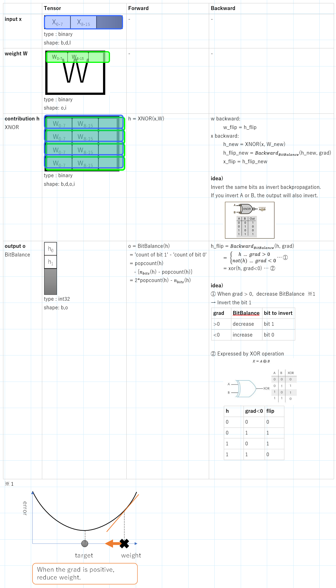


- The BMA (Binary Multiply-Accumulate) layer is a linear layer that uses binary weights and is equivalent to Linear in FP32.
  - The weights are added to each variable using the XNOR operation, and the sum of the weights is calculated using BitBalance.
  - Since each variable is weighted and summed, it is equivalent to Linear in FP32.
- The input is binary and the output is FP32.
  - It can be connected to the FP32 layer as is, or the continuous value of the output can be converted to binary and connected to the binary layer.
- Binary weights are learned by the aforementioned inversion back propagation method.

- Since they can be computed using only general bitwise operations (XNOR and PopCount), a fast process may be implemented.


# Experimental

- We will train a network including binary weights using the inverse back propagation method, and confirm whether the training converges or not.


## Experimental setup

- Training data: iris

- Model structure

  - As shown in the code below, the first layer is FP32 Linear and the second layer is binary BMA.

  - ```python
        def forward(self, x_cat, x_cont):
            x = self.fc1(x_cont)  # FP32 Linear
            x = self.relu(x)
            x = self.norm1(x)
            x = self.binary_net(x)  # Binary Module
            return x
    ```

  - The gradient of loss is converted to flip to learn the second layer, and flip is converted to grad to learn the first layer.
- Binary processing is implemented in `torch.autograd.Function` of PyTorch so that binary computation is completed in one node. (red box in the figure below)


Figure. Graph of the model visualized by torchviz. Binary processing is completed within the node indicated by the red box.

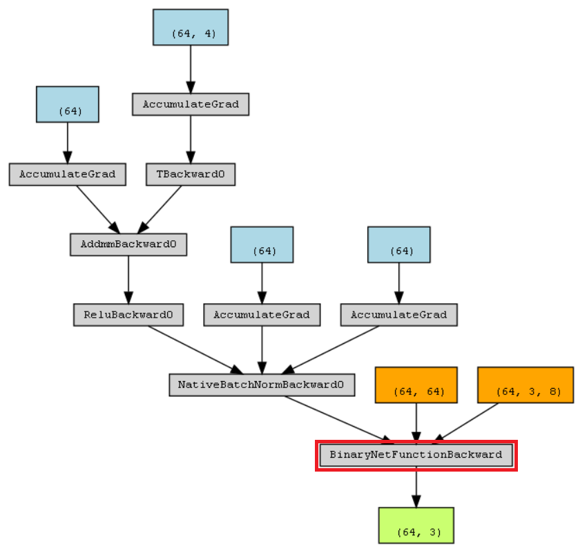


- Learning Settings

  - Learning rate changed dynamically as learning progresses by 1 Cycle Rule
    - Note: The learning rate is valid only for the FP32 layer and is not reflected in the learning of the binary layer.


    - Learning was performed twice with different batch sizes.


    - Setting values
      - 1st time: learning rate 1e-2, batch size 64, 500 epoch
      - 2nd time: learning rate 1e-2, batch size (all training data), 100epoch

- Learning evaluation index

  - flip_ratio
    - Ratio of bits that are 1's out of the back-propagating inverted signal.
    - It approaches 0 as learning progresses.
    - For example, 0.05 means that 5% of all bits should be flipped to reduce the error.

  - update_ratio 
    - Ratio of binary weights to be updated.
    - Update procedure for binary weights: Create an update mask (update: 1, leave as is: 0) with the binary values, and perform XOR operation on the weights to obtain new weights.
    - The update_ratio is the ratio of the update mask whose bits are 1.


## Results and discussion

## Convergence of learning

Figure. learning results of accuracy and loss

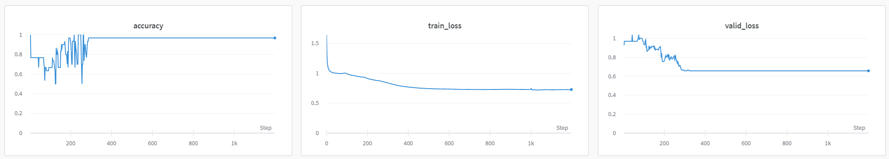

- Result: ACCURACY, train_loss, and valid_loss converge
- Discussion: This is typical behavior when learning converges.


## Binary layer (layer 2) learning

Figure. Binary layer learning results

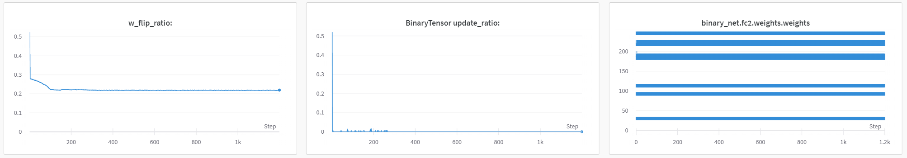

- Result
  - w_flip_ratio : getting smaller and smaller

  - BinaryTensor update_ratio : getting smaller and smaller
  - binary_net.fc2.weights.weights : convergence (almost converged at the first step)
- Consideration
  - Binary layer has been learned.
  - w_flip 20% vs. update 0%.
    - Since w_flip is aggregated to determine whether to flip the BinaryTensor weights, it is possible that even if w_flip is 20%, the flipped/non-flipped votes cancel each other out when aggregated, resulting in a weight update of 0%.


## flip to grad

Figure. Distribution of flips and gradients during training

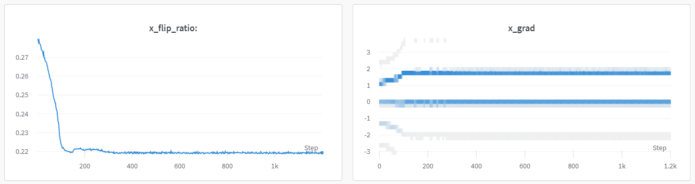

- Result
  - x_flip_raio : getting smaller and smaller
  - x_grad : distribution centered around 0
- Consideration
  - Consistent gradients can be computed.

## Learning of FP32 layer (first layer)

Figure. Learning results for the linear layer

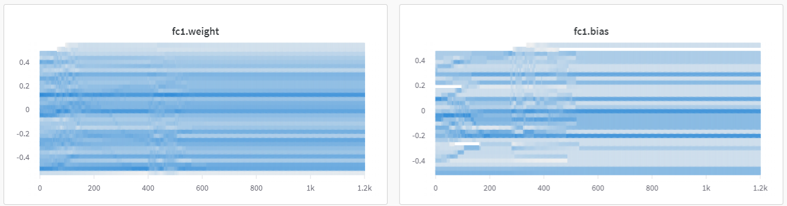

- Result
  - fc1.weight/bias : Convergence
- Discussion
  - We are able to learn FP32 layer with grad obtained from flip.


# Conclusion

- We proposed a new method for learning binary neural networks (BNN), flip back propagation, and showed that the learning converges.
- Since gradient(grad) and inversion(flip) can be converted to each other, it can be trained together with existing neural networks.
- It can be incorporated into existing pytorch frameworks for training, which is low cost to implement and easy to operate.
- Because it learns binary weights directly, it may be advantageous for "learning huge models with a large number of parameters," "learning BNNs with high accuracy," and "fast learning".

