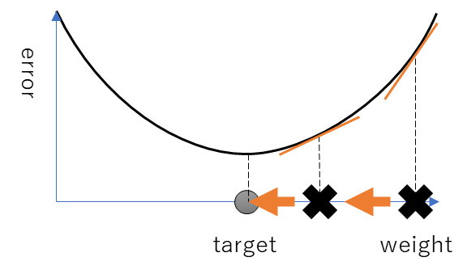

# 反転逆伝搬法によるバイナリニューラルネットワークの学習

# ～　ニューラルネットワーク学習法の全面的見直し　～


# サマリー

- バイナリニューラルネットワーク（BNN）を学習するための新手法である反転逆伝播法を提案する。
- 勾配ではなく反転を逆伝搬してBNNを学習する。勾配と反転の相互変換をすることで、既存のニューラルネットワークと一緒に学習可能なBNNを実現する。
- 既存のPyTorchフレームワークに組み込んで学習することができ、実装コストが低く、運用しやすい。
- バイナリ重みを直接的に学習するので、「パラメータ数の多い巨大なモデルの学習」や「高精度なBNNの学習」、「高速な学習」に有利である可能性がある。


# 背景

- ニューラルネットワークのパラメータ数が増加する一方で、GPUのメモリ容量は有限であり、メモリ削減が課題となっている。
- これまでのバイナリーニューラルネットワークの学習方法は、連続値であるFloat32 （FP32）重みで学習を行い、学習終了後に重みをバイナリ化する手法が一般的であった。
- しかしこの手法では、重みをバイナリ化するときの精度劣化や、学習時にVRAM使用量が大きいことが課題である。
- そこで本手法では、勾配ではなく反転を逆伝播することでバイナリ重みを直接的に学習し、上記の課題を解決する。


# バイナリ学習の特徴

## １ステップで最適値になる

- 値の更新は、反転（flip）、つまり「反転する（１） or しない（０）」の１ビットで表現する。

図．ビットを反転して更新する例


- それぞれの重みを二値だけで表現するので、更新指示が正確ならば１ステップで最適値に収束する。
  - 実際の学習では、前レイヤの学習が進むことで適切な更新指示が変わるので、１ステップで学習が終わるということではない。

- 反対に、連続値の勾配更新は複数回の更新を経て最適値に収束する。

図．連続値を勾配方向に更新する例



- そのため、FP32重みよりも少ないステップ数で学習完了できる可能性がある。


## 勾配と反転の変換

- バイナリ重みは離散値であり既存の勾配による更新は不可能であるため、バイナリ値を更新する方法を再考する必要がある。
- バイナリ値は２値のみなので、更新信号は値が反転するかどうか（flip）だけを伝える。


図. 「FP32重みの勾配」と「バイナリ重みの反転」の対応


- FP32重みをしきい値で二値化し、バイナリ重みを得るとき、勾配(grad)・反転(flip)の変換はそれぞれ以下のようになる。
    - grad to flip
      - FP32重みがしきい値を超える方向に勾配更新するとき、対応するバイナリ重みも反転する方向への更新となるので、flipは1となる。
      - FP32重みがしきい値と反対方向に勾配更新するとき、flipは0となる。
    - flip to grad 
      - 「flip」と「gradを計算したいFP32重みとしきい値の大小」から、以下のようにgradへの寄与を計算する。
        - flipが0のとき : 0
        - flipが1　かつ　FP32重みがしきい値より大きいとき : 1
        - flipが1　かつ　FP32重みがしきい値より小さいとき : -1
      - 寄与を合計してgradを求める。
- 以上の方法で、勾配と反転が相互に変換できる。


## BitBalance

- ビット列に対してBitBalanceという演算を定義した。
- 「1の数 - 0の数」で求める。
  - 「2 * PopCount - 全ビット数」でも計算できる。
- PopCountの分布は、１のビットの出現確率p=0.5のとき、平均 0.5N、標準偏差0.5√Nの二項分布となる。
- BitBalanceの分布はp=0.5のとき、平均 0、標準偏差0.5√Nの二項分布となる。
- そのため、BitBalanceで集計した値は平均値より大きいか判定しやすく、二値化などがしやすいため、BMAの積算などにBitBalanceを採用した。


# 提案手法

## 学習手法：反転逆伝播法

- バイナリ値の反転を逆伝播して学習を行う新たな学習手法、反転逆伝播法を提案する。
- バイナリ重みの更新は、既存の勾配更新方法では不可能であるため、反転を使用して更新する。


図．勾配と反転を相互変換しながら逆伝播する様子


- 学習手順
  1. grad to flip：勾配を反転へ変換する。
  1. 重みの更新：逆伝搬した反転をミニバッチなどで集計して、重みを反転(flip)するか決める。本実験で学習したモデルでは、図のBMAレイヤ（後述）に含まれる重みを更新する。
  1. flip to grad：反転を勾配に変換して前のレイヤへ逆伝播する。（そのため、通常のニューラルネットワークを一緒に学習できる）

- この反転逆伝播法により、重みと逆伝播信号の両方がバイナリ化され、メモリ消費を大幅に削減できる


## 学習を収束させる工夫

### 反転投票を増やして正確に更新する

- 課題
  - バイナリ重みは「１ステップで最適値になる」「1bitなので過去の更新情報を積算・保持できない」ので、１回の更新信号の正確さが重要となる。
  - 更新信号を正確にするには、重みを更新するか判断するために反転を集計するときの投票数を増やす必要がある。
- 対策：反転の投票数を増やす方法として、以下が考えられる
  - バッチサイズを大きく：バッチサイズを大きくすると、１回の更新で多くの入力データを考慮するので、反転の投票数を増やせる。
  - 多重度を大きく：バイナリ重みを複数箇所で使用すると、それぞれから逆伝播信号を得られるので、反転の投票数を増やせる。CNNやRNNのような重み共有が有効である。
    - なお、後述のdepth変調も重み共有による多重化の恩恵がある。各depth軸に対して同一の重みを適用するので、それぞれのdepthから逆伝播信号を得られる。
- 反転投票の例
  - 本実験では、「b,d,o,i」軸を持つテンソルを入出力し、「o,i」軸を持つバイナリ重みテンソルを学習した。
  - バッチサイズb=64, depth軸 d=3 のとき、各重みビットに対して64*3 = 192の反転投票となる。


### 直列逆伝播

- 課題
  - XNORのようなビット演算は、入力の片方が反転すると、結果がまったく変わってしまう。
  - そのため、２つの入力に同時に逆伝播（並列逆伝播）して両入力が反転するように学習した場合、求める結果を得られない。

- 対策 - 直列逆伝播：そこで、まず片方の入力に逆伝播し、更新した入力で反転信号を再計算して、もう片方の入力に逆伝播する（直列逆伝播）。
  - たとえば、BMAレイヤでは、経路の浅い重みを先に更新している。
- デメリット：直列逆伝播では、複数経路を同時に学習できないので、プロセッサの並列度を十分に利用できず計算効率が悪化する可能性がある。


図．逆伝播の経路の例


### depth変調

- 異なるしきい値でバイナリ化したデータを、同一のネットワークに入力することで、メモリフットプリントを抑えつつ精度を向上させる先行研究がある。
  - 参考：[Fully Binary Neural       Network への変調入力の評価結果(復刻記事)](https://ryuz.hatenablog.com/entry/2021/04/03/211029)
- この手法に倣い、Binarizeレイヤの出力テンソルは、ビット深度に相当するdepth軸を追加し、しきい値の数だけデータを保持する。
  - たとえば、３つのしきい値で二値化して、depth軸が3のテンソルを扱うことで、ビット深度２（4通りの値）相当のデータを表現できる。
    


### オフライン学習

- 課題：ミニバッチ学習の後期に、accuracyが振動する現象が見られた。

図．学習の後期にaccuracyが振動


- 原因：BNNの１ステップで最適値になる特性により、ミニバッチのサンプル組み合わせのランダム性が汎化性能に影響したと思われる。
- 対策：そこで、学習の最後に全データで学習（オフライン学習）することで回避した。


## 本手法のメリット

- 学習時の低VRAM：「学習時の重み・順伝播値・逆伝播値」がバイナリ値であるため少ないVRAMで学習でき、パラメータ数の多い巨大なモデルを学習する際に有利な可能性がある。

- 高精度なBNN：バイナリ重みを直接的に学習するため、高精度なBNNの学習に有利である可能性がある。
- 高速学習：バイナリ学習の１ステップで最適値になる特性により、FP32ニューラルネットワークよりも少ないステップ数で学習が完了できる可能性がある。


# 実装

- 勾配・反転を相互に変換できるので、既存のPyTorchの一部として実装した。
- 既存のフレームワークを活用できるため、実装コストが低く、運用しやすい。
  - 特に、学習データの読み込みや学習ワークフローは、PyTorch+fastaiの仕組みをそのまま利用することができた。

- テンソル軸：順伝播・逆伝播するテンソルの軸は、最大で`b,d,o,i`とした
    - b(batch) : ミニバッチ
    - d(depth) : depth変調（ビット深度に相当）
    - o(out) : BMAレイヤの変換後の次元数
    - i(in) : BMAレイヤの変換前の次元数


## Layerの実装

### Binarize Layer

- 入力されたFP32テンソルを複数のしきい値で二値化して、バイナリテンソルを出力する。
- 逆伝播では、反転から寄与を計算して勾配を求める


図．Binarizeレイヤのまとめ：Tensor形状とForward/Backward計算方法


### BMA（Binary Multiply-Accumulate） Layer

- 以下の論文を参考に、XNORとビットカウントによるバイナリ版 積和演算を実装した。

  - 論文　[Bitwise Neural Networks](https://saige.sice.indiana.edu/wp-content/uploads/icml2015_mkim.pdf)

  - 解説ブログ [Understanding Binary Neural Networks - ALL THINGS GEEKY](https://sushscience.wordpress.com/2017/10/01/understanding-binary-neural-networks/)

    - FP32の積和演算を、BinaryのXNORとAccumulateに置き換える

    - XNOR と Popcount は、MAC（積和演算）よりもはるかに少ないゲートで実装できる。


図．BMAレイヤのまとめ：Tensor形状とForward/Backward計算方法


- BMA（Binary Multiply-Accumulate）レイヤは、バイナリ重みを使用する線形レイヤーで、FP32のLinearに相当する。
  - XNOR演算で各変数に重みを付け、その合計をBitBalanceで計算する。
  - 各変数に重みを付けて合計するので、FP32のLinearに相当する。
- 入力はバイナリで、出力はFP32。
  - そのままFP32レイヤに接続したり、出力の連続値を二値化してバイナリレイヤへ接続することも可能。
- バイナリ重みは、前述の反転逆伝播法で学習する。

- 一般的なビット演算（XNORとPopCount）のみで計算できるので、高速な処理を実装できる可能性がある。


# 実験

- バイナリ重みを含むネットワークを反転逆伝播法で学習し、学習が収束するか確認する。


## 実験設定

- 学習データ：　iris

- モデル構造

  - 以下のコードのように、１層目はFP32のLinear、２層目はバイナリのBMAとした。

  - ```python
        def forward(self, x_cat, x_cont):
            x = self.fc1(x_cont)  # FP32 Linear
            x = self.relu(x)
            x = self.norm1(x)
            x = self.binary_net(x)  # Binary Module
            return x
    ```

  - lossの勾配を、flipに変換して２層目を学習し、flipをgradに変換して１層目を学習する。
- バイナリ処理は、PyTorchの`torch.autograd.Function`に実装して、１つのノードの中でバイナリ計算を完結させるようにした。（下図赤枠）


図．torchvizで可視化したモデルのグラフ。バイナリ処理は、赤枠で示したノード内で完結する。


- 学習設定

  - 学習率は、1 Cycle Ruleによって学習の進行に合わせて動的に変更した
    - 注）学習率はFP32レイヤだけに有効で、バイナリレイヤの学習には反映されない


    - バッチサイズを変えて２回の学習を行った。


    - 設定値
      - １回目：学習率 1e-2, バッチサイズ64, 500epoch
      - ２回目：学習率 1e-2, バッチサイズ（全学習データ）, 100epoch

- 学習の評価指標

  - flip_ratio
    - 逆伝播する反転信号のうち、1のビットの割合。
    - 学習が進むにつれて0へ近づく。
    - 例えば、0.05なら、誤差を小さくするために全ビットの5%が反転すべきということ。

  - update_ratio 
    - バイナリ重みを更新する割合。
    - バイナリ重みの更新手順：バイナリ値で更新マスク（更新：１、そのまま：０）を作成し、重みにXOR演算して新しい重みを得る。
    - 更新マスクの、ビットが１の割合をupdate_ratioとする。


# 結果・考察

## 学習の収束性

図．accuracy, lossの学習結果


- 結果：accuracy, train_loss, valid_lossが収束する
- 考察：学習が収束する時に典型的な振る舞いである。


## バイナリレイヤ（第二層）の学習

図．バイナリレイヤの学習結果


- 結果
  - w_flip_ratio : 小さくなっていく

  - BinaryTensor update_ratio : 小さくなっていく
  - binary_net.fc2.weights.weights : 収束する（１ステップ目でほぼ収束）
- 考察
  - バイナリレイヤが学習できている
  - w_flip 20%に対してupdate 0% である点について
    - w_flipを集計してBinaryTensorの重みを反転するか決めるので、w_flipが20%でも、集計すると反転・非反転の投票が打ち消しあって、結果的に重み更新は0%ということはありうる。


## flip to grad

図．学習時の反転・勾配の分布


- 結果
  - x_flip_raio : 小さくなっていく
  - x_grad : ０を中心とした分布となる
- 考察
  - 一貫性のある勾配が計算できている

## FP32レイヤ（第一層）の学習

図．Linearレイヤの学習結果


- 結果
  - fc1.weight/bias : 収束する
- 考察
  - flipから求めたgradでFP32レイヤを学習できている。


# 結論

- バイナリニューラルネットワーク（BNN）を学習するための新手法である反転逆伝播法を提案し、学習が収束することを示した。
- 勾配と反転を相互に変換できるので、既存のニューラルネットワークと一緒に学習可能である。
- 既存のpytorchフレームワークに組み込んで学習することができ、実装コストが低く、運用しやすい。
- バイナリ重みを直接的に学習するので、「パラメータ数の多い巨大なモデルの学習」や「高精度なBNNの学習」、「高速な学習」に有利である可能性がある。

