# FBF learning of full binary NN by flip backprop

# Summary

In the previous report, we proposed learning by serial back propagation, but weight-first learning caused vanishing update signal. Therefore, we introduced Forward-Backward-Forward (FBF) learning, in which the input layer is learned first and the binary weights are updated in the second Forward, to improve the vanishing update signal.

With this method, a binary neural network whose weights are all binary values (Full binary NN) was directly binary-trained using the flip backward propagation method, achieving an accuracy of around 90% on the iris data set.

Prerequisite for reading this article: "[Flip backprop](. /v1/01_report_flip-backprop.md)".

# FBF learning

## Issue: weight-first Series back propagation causes vanishing update signal

In the previous article, series back propagation was learned weight-first.

**Figure. Execution order of weight-first series back propagation**.
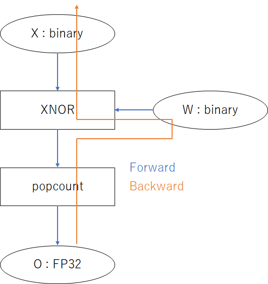

However, at the early stage of learning, we noticed that the flip of back propagation to the forward layer (input side) was almost zero (update signal disappearance), and learning did not progress.

The cause was thought to be the order of series back propagation. In weight-first serial back propagation, the weights of the backward layer are updated first, and then the update signal (flip) of the forward layer is calculated so that the weights match. In this case, the backward layer learned first makes the update signal smaller, making it difficult for the forward layer to learn.

Conversely, what if the forward layer is updated first, and then the weights of the backward layer are updated so that the weights match the updated input? The forward layer will learn more, and the backward layer will learn to further reduce the error.

## Solution: Input-first Series back Propagation and FBF Learning

Therefore, we considered input-first serial back propagation, in which the forward layer (input side) is learned first, and FBF (Forward-Backward-Forward) learning to realize this.

The operation of FBF learning is to learn the input side preferentially at Backward and update the binary weights in order from the forward layer at the second Forward. Therefore, the backward layer can be learned so that the update of the forward layer is consistent with the update of the forward layer.

**Figure. Execution order of input-first serial back propagation**.
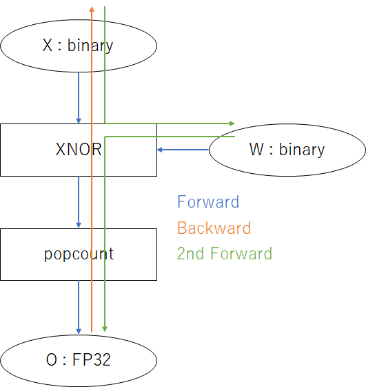

Although the increase in learning to 1.5 round trips per step is a disadvantage, the accuracy of a single update is expected to improve. This technique is considered suitable for binary learning, where the accuracy of the update signal is important.

# Other learning techniques

## update suppressor

The update suppressor is a hyperparameter of the learning management that specifies the suppression ratio as an integer greater than or equal to 0.

**Figure. update suppressor value and percentage of bits to be updated**.
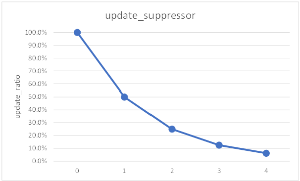

update suppressor corresponds to the learning rate of FP32 learning and is used to adjust the trade-off between learning speed and convergence.

# Functions and modules

The components of the model are functions/modules and modules that combine them.

**Figure. Combination of functions/modules**.
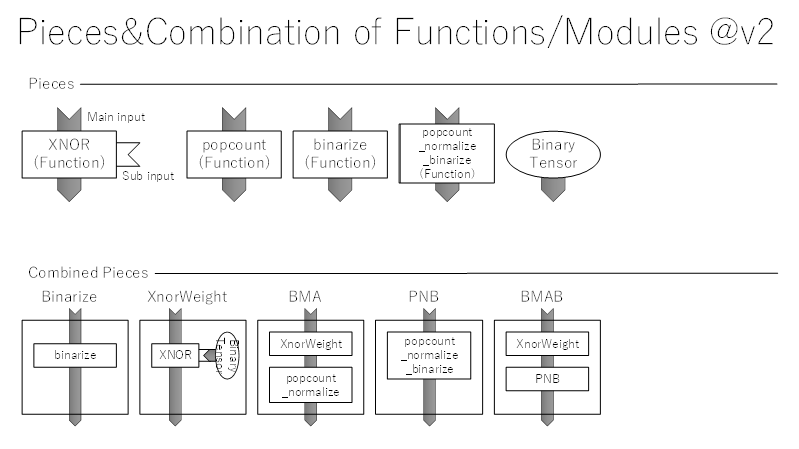

## List

The table below lists the type of input/output tensor, the form of the inverse propagation signal, and the axes of the input/output tensor for functions and modules.

**Table. List of functions and modules used in this method** *1

| **Functions/Modules** | **dtype of in/out** | **Format of  Backward signal** ※２ | **Axes of tensors** |
| ------------------------------------------------------------ | ------------------- | --------------------------------------- | -------- ---------------------------------------------------- |
| **popcount** | uint8 <-> fp32 | flip <- grad ❗ | bdoi -> bo bdoi <- bo |
| **binarize** | fp32 <-> uint8 | grad <- flip ❗ | bx -> bdx bx <- bdx |
| **PNB**  **popcount_normalize  _binarize** **popcount_binarize** | uint8 <-> uint8 | flip <- flip | bdoi -> bdo bdoi <- bdo |
| **xnor** | uint8 <-> uint8 | flip <- flip | … -> … … <- … |
| **BinaryTensor** | (None) <-> uint8 | flip <- flip | (None) -> oi (None) <- oi |
| **XnorWeight** | uint8 <-> uint8 | flip <- flip | x:bdi, w:doi -> bdoi x : bdi <- bdoi w : doi <- bdoi |
| **BMA** | uint8 <-> fp32 | flip <- grad ❗ | bdi -> bo bdi <- bo |
| **BMAB** | uint8 <-> uint8 | flip <- flip | bdi -> bdo bdi <- bdo |

※１
- -> : Forward
- <- : Backward

※２：❗Needs flip/grad conversion

※BitBalance is no longer in use. Bit aggregation usually requires standardization, but the binomial distribution of popcount is easier to calculate the mean "pN" and standard deviation "√Np(1-p)".

The number of dimensions for each symbol in Axes of tensors is shown in the table below.

**Table. Number of dimensions for each symbol in Axes of tensors**

| **Symbol** | Meaning | **Number of dimensions** |
| ---------- | --------------- | ----------------------------------------------------- |
| b | batch | batch size |
| d | depth | number of thresholds for binaryization |
| x | (input tensor) | number of features for each sample | o | output | number of features
| o | output | number of output features for layers with varying number of features (BMA, BMAB, etc.)
| i | input | number of input features for layers with changing number of features (BMA, BMAB, etc.)

## PNB (popcount_normalize_binarize)

A function that combines the three operations "popcount, normalize, and binarize" and the corresponding module are provided.

The popcount and binarize functions require grad2flip and flip2grad, respectively, during back propagation, and the float operation for grad standardization is necessary, which spoils the high-speed and memory-saving features of binary learning.

Therefore, we prepared a function/module that combines these functions. The format of the back propagation tensor is flip2flip, which has the advantage of reducing the amount of computation by eliminating the standardization of grad in the process.

**Figure: Process flow of PNB**.
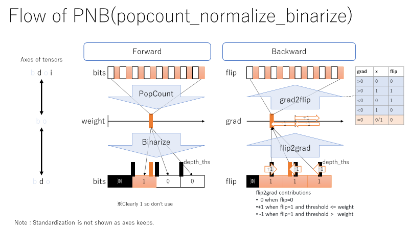

## BMAB (Binary Multiply-Accumulate Binarize)

This module combines two modules, BMA and Binarize.

Like PNB, it has the advantage of reducing the amount of calculation by omitting the grad standardization process in the middle.

# Experimental details

## Model structure

Only modules with binary weights (BMAB and BMA) are trained.

Since BMAB and BMA work like a linear layer, we can expect learning similar to a neural network consisting of two linear layers.

**Figure. Structure of the model trained in this experiment**.
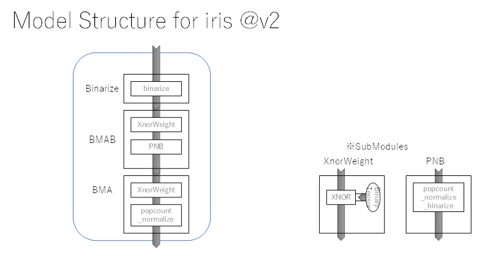

## Learning setup

The learning process is divided into two parts: 1st learn, which is fast learning, and 2nd learn, which has good convergence.

**Table. List of learning settings for this experiment**

|  | **1st learn** | **2nd learn** |
| --------------------- | ------------- | ------------- |
| **epoch** | 10 | 10 |
| **batch size** | 32 | all(120) |
| **update suppressor** | 0 (100%) | 1 (50%) |

## Evaluation metrics

### mean_of_bits

mean_of_bits" is an metrics to judge the validity of a feature. It is the mean value of the output bits and takes values in the range of 0~1.

If all the bits in the aggregate range have the same value, the mean_of_bits will be 0 or 1.

When the value is 0 or 1, it means that the same value is always output regardless of the input, which is not significant as a feature.

Conversely, when the value is around 0.5, it means that the feature is significant.

 

For example, the following is the mean_of_bits of the forward propagation output of the Binarize layer in this experiment.

(Aggregated for each feature. In terms of tensor axis reduce, "b d x -> x")

**Figure. Mean_of_bits of the forward propagation output of the Binarize layer**.

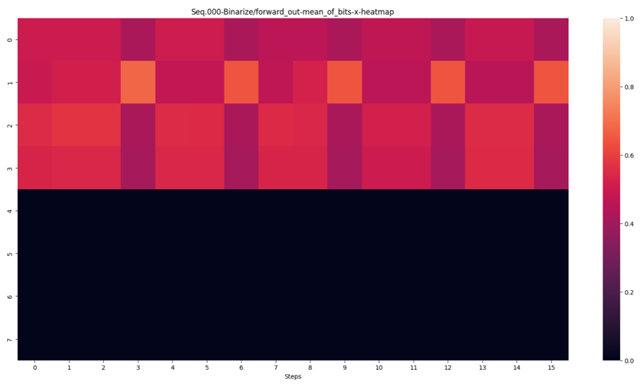

The upper 4 bits are significant features in the neighborhood of 0.5. This is because the four explanatory variables in the iris dataset, sepal length (cm), sepal width (cm), petal length (cm), and petal width (cm), are binary output values.

The lower 4 bits always output 0, which lacks validity as a feature. This is because the latter 4 bits are filled with 0 when bit-packed.

# Experimental Results and Discussion

Experimental results: [[v2 : Full binary NN] Experimental results](https://api.wandb.ai/links/lilacs2039/jdka9d9s)

## Convergence of learning

**Figure. accuracy and loss during learning**
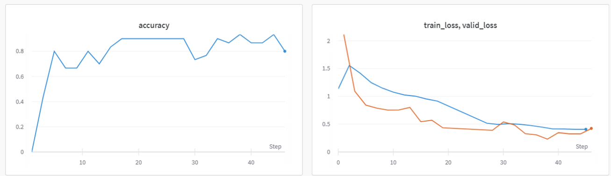

Results

- Accuracy exceeded 90%.
- train_loss and valid_loss are continuously reduced and the value is equalized.

Thoughts

- This is typical behavior when learning converges.

   

## Inverse transmission signal

**Table. flip_ratio/grad during learning**

|          | **000-Binarize**                                             | **001-BMAB**                                                 | **002-BMA**                                                  |
| -------- | ------------------------------------------------------------ | ------------------------------------------------------------ | ------------------------------------------------------------ |
|          | 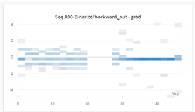 | 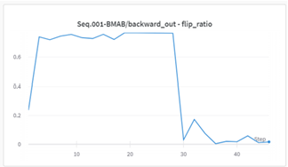 | 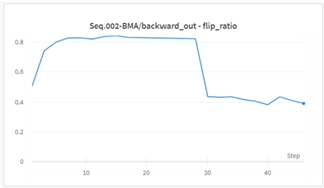 |
| **results** | 1st learn has many non-zero gradients. 2nd learn has many zero gradients. | flip_ratio becomes almost 0 at 2nd learn. | Less than 0.5 in 2nd learn |
| **Thoughts** | It seems that the vanishing gradient of 1st learn has been avoided. It seems that the reason why there are many zero gradients in the 2nd learn is that the learning progressed appropriately. | It seems that most of the flips became 0 because the appropriate output can be obtained by learning. | It seems that it became smaller due to the effect of update_suppressor. |

What I found out

- No unlearning occurred due to vanishing update signal.
- Appropriately learned.

 

## forward propagating signal

**Table. Forward propagating signal (mean_of_bits, standardized popcount) during learning**

| | **000-Binarize** | **001-BMAB** | **002-BMA** |
| -------- | ------------------------------------------------------------ | ----------------------------------- ------------------------- | ------------------------------------------------------------ |
|          | 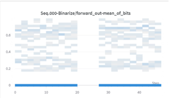 | 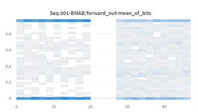 | 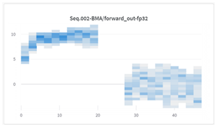   *Standardized popcount |
| **Results** | Learning does not change. | More bits near 0.5. | The output of 2nd learn is close to the standard normal distribution |
| **Thoughts** | Before Binarize, there are no learning parameters (norm is excluded). | Learning is progressing to output valid values. | The output of 2nd learn is as expected.  I don't know why I get strange values in 1st learn. |

What I found out

- After 2nd learn, reasonable forward propagation output is obtained.

# Summary

- Introduced FBF learning to improve vanishing update signal.
- Direct binary learning of full binary NN by flip backpropagation achieved an accuracy of about 90% on the iris dataset.

