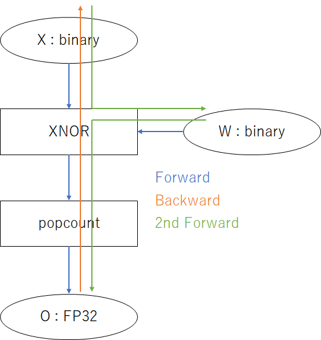
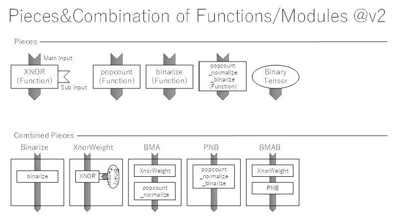
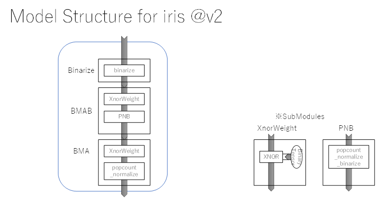
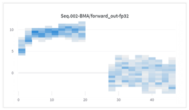

# 反転逆伝搬法とFBF学習によるFull binary NNの学習

# サマリー

前レポートでは直列逆伝播による学習を提案したが、重みの優先的な学習が更新信号消失の原因となっていた。そこで、入力層を優先して学習し、２回目のForwardでバイナリ重みを更新するFBF(Forward-Backward-Forward)学習を導入することで、勾配消失を改善することが可能となった。

本手法で、重みがすべてバイナリ値であるバイナリニューラルネットワーク（Full binary NN）を反転逆伝播法で直接バイナリ学習することにより、irisデータセットで90%程度の精度を達成した。

本記事を読む前提：「[Flip backprop](../v1/01_report_flip-backprop.md)」について知っていること。

# FBF学習

## 課題：重み優先 直列逆伝播は更新信号消失が発生する

前記事では、直列逆伝播は重みを優先して学習していた。

**図．重み優先 直列逆伝播の実行順序**

しかし、学習初期の時点で、前方レイヤ（入力側）への逆伝播のflipがほとんど0であり（更新信号消失）、学習が進まないことに気づいた。FP32学習の勾配消失のような現象で、更新信号が小さいため前方レイヤの学習が進まない状況である。

原因は、直列逆伝播の順序にあると考えた。重み優先の直列逆伝播では、後方レイヤの重みを先に更新してから、辻褄が合うように前方レイヤの更新信号（反転）を計算する。この場合、先に学習された後方レイヤが更新信号を小さくしてしまうので、前方レイヤの学習が進みにくい。

では逆に、前方レイヤを先に更新して、更新された入力と辻褄が合うように後方レイヤの重みを更新すればどうか。前方レイヤは学習が進み、後方レイヤがさらに誤差を小さくするよう学習されるのではないだろうか。

## 解決策：入力優先 直列逆伝播とFBF学習

そこで、前方レイヤ（入力側）を優先的に学習する入力優先の直列逆伝播と、それを実現するFBF（Forward-Backward-Forward）学習を考えた。

FBF学習の動作は、Backward時に入力側を優先して学習し、２回目のForwardで前方レイヤから順番にバイナリ重みを更新する。このため、前方レイヤの更新に辻褄が合うように後方レイヤを学習できる。

**図．入力優先 直列逆伝播の実行順序**

１ステップの学習が1.5往復に増加することはデメリットであるが、１回の更新の正確さは向上すると考えられる。更新信号の正確さが重要なバイナリ学習に適した手法であると考えられる。

# その他の学習テクニック

## update suppressor

学習の抑制機構として、バイナリ重みの更新マスクの1のビット（更新するビット）をランダムに0へ反転させて、更新を抑制する抑制マスクを導入した。update suppressorは、その抑制の割合を0以上の整数で指定する学習管理のハイパーパラメータである。

**図．update suppressorの指定値と更新するビットの割合**

update suppressorはFP32学習の学習率に相当し、学習速度と収束性のトレードオフを調整するために使用する。

# 関数・モジュール一覧

下表に、本手法で利用する関数やモジュールの入出力テンソルの型、逆伝搬信号の形式、入出力テンソルの軸を示した。

**表．本手法で利用する関数・モジュールの一覧**

| **Functions/Modules**                                        | **dtype of in/out** ※１                 | **Format of Backward signal**  | **Shape**s                                                   |
| ------------------------------------------------------------ | -------------------------------------------- | ------------------------------ | ------------------------------------------------------------ |
| **popcount**                                                 | uint8  <-> fp32                              | flip <- grad　❗                | bdoi  -> bo bdoi  <- bo                                 |
| **binarize**                                                 | fp32  <-> uint8                              | grad <- flip　❗                | bx ->  bdx bx <-  bdx                                   |
| **PNB**   **popcount_normalize     _binarize** **popcount_binarize** | uint8  <-> uint8                             | flip  <- flip                  | bdoi  -> bdo bdoi  <- bdo                               |
| **xnor**                                                     | uint8  <-> uint8                             | flip <- flip                   | … ->  …   … <-  …                                       |
| **BinaryTensor**                                             | (None)  <-> uint8                            | flip  <- flip                  | (None)  -> oi (None)  <- oi                             |
| **XnorWeight**                                               | uint8  <-> uint8                             | flip <- flip                   | x:bdi,  w:doi -> bdoi x : bdi <- bdoi w : doi <- bdoi |
| **BMA**                                                      | uint8  <-> fp32                              | flip <- grad ❗                 | bdi  -> bo bdi  <- bo                                   |
| **BMAB**                                                     | uint8  <-> uint8                             | flip  <- flip                  | bdi  -> bdo bdi  <- bdo                                 |
| **Notes**                                                    | ※１   -> :  Forward <- :  Backward | ❗Needs flip/grad    conversion |                                                              |

※BitBalanceはもはや使用していない。ビットの集計はたいてい標準化が必要だが、popcountの二項分布の方が平均「pN」・標準偏差「√Np(1-p)」の計算が簡単なため。

**図．関数・モジュールの組み合わせ**

# 実験内容

## モデル構造

バイナリ重みを持つモジュール（BMABとBMA）のみを学習する。

BMABとBMAは線形レイヤのような働きをするので、２層の線形レイヤからなるニューラルネットワークに近い学習が期待できる。

**図．本実験で学習させたモデルの構造**

## 学習設定

学習の速い1st learnと、収束性の良い2nd learnの２回に分けて学習する。

**表．本実験の学習設定の一覧**

|                       | **1st learn** | **2nd learn** |
| --------------------- | ------------- | ------------- |
| **epoch**             | 10            | 10            |
| **batch size**        | 32            | all(120)      |
| **update suppressor** | 0 (100%)      | 1 (50%)       |

## 評価指標

### mean_of_bits

"mean_of_bits"は特徴量の有効性を判断する指標である。出力ビットの平均値であり、0~1の範囲の値をとる。

集計範囲のビットがすべて同じ値なら、mean_of_bitsは0か1となる。

0または1のとき、入力に関わらず常に同じ値を出力するということであり、特徴量として有意性に欠ける。

逆に、値が0.5付近であるとき、特徴量が意義深いことを意味する。

 

たとえば、以下は本実験におけるBinarizeレイヤの順伝播出力のmean_of_bitsである。

（特徴量ごとに集計。テンソル軸のreduceでいえば、「b d x -> x」）

**図．Binarizeレイヤの順伝播出力のmean_of_bits**

上側４ビットは0.5近傍で有意義な特徴量である。これは、irisデータセットの説明変数４つ「sepal length (cm)、sepal width (cm)、petal length (cm)、petal width (cm)」をバイナリ化した出力値のためである。

下側４ビットは常に０を出力しており、特徴量としての有効性に欠ける。これは、ビットパック時に後半4ビットを0埋めしているためである。

# 実験の結果・考察

## 学習の収束性

**図．学習時のaccuracy, lossの変動**

結果

- accuracyは90%を超える
- train_loss, valid_lossは継続的に減少し、一定値へ収束する

考察

- 学習が収束する時に典型的な振る舞い。

   

## 逆伝播信号

**表．学習時の逆伝播信号（flip_ratio・grad）の結果と考察**

|          | **000-Binarize**                                             | **001-BMAB**                                                 | **002-BMA**                                                  |
| -------- | ------------------------------------------------------------ | ------------------------------------------------------------ | ------------------------------------------------------------ |
|          |  |  |  |
| **結果** | 1st learnは非ゼロの勾配が多い。 2nd learnはゼロの勾配が多い。 | 2nd learnでflip_ratioがほぼ０になる。                        | 2nd  learnで0.5より小さくなる                                |
| **考察** | 1st learnの勾配消失は回避できていると思われる。 2nd learnに勾配ゼロが多いのは適切に学習が進んだためと思われる。 | 学習により適切な出力ができるので、ほとんどのflipが0になったと思われる。 | update_suppressorの効果で小さくなったと思われる。            |

分かったこと

- 勾配消失による未学習は起きていない。
- 適切な学習が行われていること

 

## 順伝播信号

**表．学習時の順伝播信号（mean_of_bits・標準化したpopcount）の結果と考察**

|          | **000-Binarize**                                             | **001-BMAB**                                                 | **002-BMA**                                                  |
| -------- | ------------------------------------------------------------ | ------------------------------------------------------------ | ------------------------------------------------------------ |
|          |  |  |    ※標準化したpopcount |
| **結果** | 学習しても変化しない。                                       | 0.5近傍のビットが多くなる。                                  | 2nd  learnの出力は標準正規分布に近くなる                     |
| **考察** | Binarize以前は学習パラメータないため（normは除外）。         | 有効な値を出力するように学習が進んでいる。                   | 2nd  learnの出力は期待通り。 1st  learnで変な値になるのはなぜか分からない。 |

分かったこと

- 2nd learnの後は、妥当な順伝播出力が得られている。

# まとめ

- FBF学習を導入して更新信号消失を改善した。
- Full binary NNを反転逆伝播法で直接バイナリ学習することで、irisデータセットで90%程度の精度を達成した。

